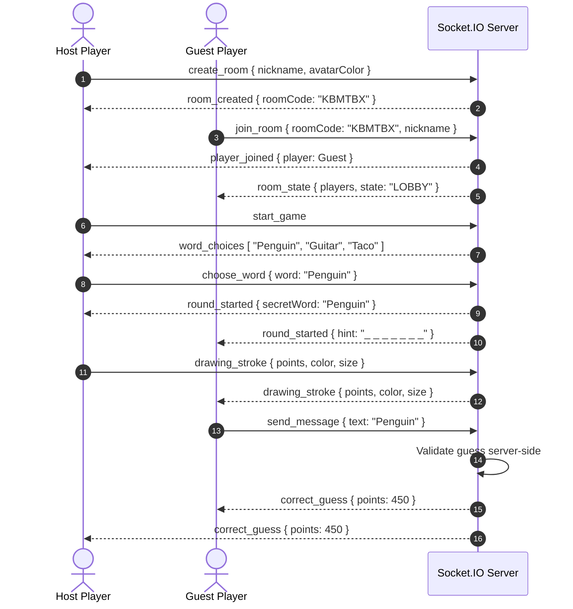

# SKRIBBLE.BRUTAL // Multiplayer Drawing & Guessing Game

> A production-ready real-time multiplayer browser drawing-and-guessing game built with React, Node.js, Socket.IO, and a high-contrast **Neo-Brutalist Visual Design System**.

---

## Architecture Overview


### Event Sequence Diagram



---

## Technology Stack

| Domain | Technologies |
| :--- | :--- |
| **Frontend** | React 18, Vite, HTML5 Canvas API, Socket.IO Client, Lucide Icons, Canvas Confetti |
| **Backend** | Node.js, Express.js, Socket.IO Server, CORS, Dotenv |
| **Styling** | Vanilla Neo-Brutalist CSS (Google Fonts: *Space Grotesk*, *Inter*) |
| **Deployment** | Frontend → Vercel, Backend → Render (Persistent Web Service) |

---

## Repository Structure

```
/
├── client/                     # Frontend Vite React App
│   ├── src/
│   │   ├── components/         # GameCanvas, DrawingToolbar, PlayerList, ChatPanel, etc.
│   │   ├── context/            # SocketContext, GameContext
│   │   ├── pages/              # HomePage, LobbyPage, GamePage
│   │   ├── styles/             # main.css (Neo-Brutalist design tokens)
│   │   ├── App.jsx             # State router
│   │   └── main.jsx            # Entry point
│   ├── package.json
│   ├── vite.config.js
│   └── .env.example
│
├── server/                     # Backend Node.js Express Server
│   ├── src/
│   │   ├── game/               # GameManager, GameRoom, Player, ScoreManager, WordManager
│   │   ├── rooms/              # RoomManager
│   │   ├── sockets/            # socketHandler, roomEvents, gameEvents, drawingEvents
│   │   ├── words/              # wordList (200+ categorized words)
│   │   ├── routes/             # healthRoutes (/api/health)
│   │   ├── utils/              # roomCodeGenerator
│   │   ├── app.js              # Express app setup
│   │   └── server.js           # Server listener (0.0.0.0 binding)
│   ├── package.json
│   └── .env.example
│
├── package.json                # Monorepo root helper
└── README.md
```

---

## Local Development Setup

### 1. Install Dependencies
Run the install command from the project root:
```bash
npm run install:all
```
*(Or install manually in both `./client` and `./server`)*

### 2. Configure Environment Variables
Copy `.env.example` to `.env` in both folders:

**Server (`./server/.env`)**:
```ini
PORT=5000
CLIENT_URL=http://localhost:5173
NODE_ENV=development
```

**Client (`./client/.env`)**:
```ini
VITE_API_URL=http://localhost:5000
```

### 3. Start Development Servers
Run both backend and frontend concurrently from the root directory:
```bash
npm run dev
```

- **Frontend**: `http://localhost:5173`
- **Backend API**: `http://localhost:5000`
- **Backend Health Check**: `http://localhost:5000/api/health`

---

## Socket.IO Event Reference

### Room Events
- `create_room` (`client -> server`): Creates a new room and sets host.
- `join_room` (`client -> server`): Joins room using 6-character room code.
- `leave_room` (`client -> server`): Leaves active room.
- `update_settings` (`client -> server`): Host adjusts total rounds / round time.
- `room_state` (`server -> client`): Emits public room state, player list, and game status.

### Game Lifecycle Events
- `start_game` (`client -> server`): Host initiates match.
- `word_choices` (`server -> drawer client`): Delivers 3 secret word options.
- `choose_word` (`drawer client -> server`): Drawer chooses secret word.
- `round_started` (`server -> client`): Signals round start (secret word to drawer, mask to others).
- `timer_update` (`server -> client`): Server-authoritative timer countdown.
- `hint_update` (`server -> non-drawers`): Reveals hint letters periodically.
- `round_ended` (`server -> client`): Displays revealed word & round scores.
- `game_ended` (`server -> client`): Triggers victory podium.

### Drawing Events
- `drawing_stroke` (`drawer client <-> server <-> clients`): Transmits stroke coordinates (`points`, `color`, `size`, `tool`).
- `clear_canvas` (`drawer client <-> server <-> clients`): Clears canvas for room.
- `undo` (`drawer client <-> server <-> clients`): Removes last stroke.

### Chat & Guessing Events
- `send_message` (`client -> server`): Sends chat or guess attempt.
- `receive_message` (`server -> client`): Broadcasts formatted chat message.
- `correct_guess` (`server -> client`): Broadcasts correct guess notification.

---

## Deployment Guide

### Backend → Render Deployment (Web Service)

1. Sign in to [Render](https://render.com) and click **New → Web Service**.
2. Connect your Git repository.
3. Set the following settings:
   - **Root Directory**: `server`
   - **Environment**: `Node`
   - **Build Command**: `npm install`
   - **Start Command**: `npm start`
4. Add Environment Variables:
   - `NODE_ENV` = `production`
   - `CLIENT_URL` = `https://your-client-app.vercel.app`
5. Click **Create Web Service**. Render will expose a URL (e.g. `https://skribble-backend.onrender.com`).

### Frontend → Vercel Deployment

1. Sign in to [Vercel](https://vercel.com) and click **Add New Project**.
2. Select your repository.
3. Set **Framework Preset**: `Vite`.
4. Set **Root Directory**: `client`.
5. Add Environment Variable:
   - `VITE_API_URL` = `https://skribble-backend.onrender.com` (Your deployed Render backend URL).
6. Click **Deploy**.

---

## Security & Validation Measures

- **Server-Authoritative State**: Scores, secret word, current drawer, turn rotation, and timers exist only on the server.
- **Drawer Verification**: Drawing socket events are validated server-side to ensure only the designated drawer can draw or edit the canvas.
- **Word Privacy**: Secret words are never transmitted to non-drawing clients or stored in DOM/URL.
- **Chat Leak Filter**: Automatic detection blocks chat messages containing the secret word during drawing rounds.
- **Input Sanitization**: Length bounds and string trimming on nicknames (max 16 chars) and chat messages (max 150 chars).

---

## Scaling & Future Considerations

1. **Redis Adapter**: Integrate `@socket.io/redis-adapter` for multi-instance horizontal scaling across persistent worker nodes.
2. **Persistent Database**: Add PostgreSQL / MongoDB with Prisma ORM to save user statistics, lifetime leaderboards, and custom word packs.
3. **WebRTC Integration**: Optional peer-to-peer audio chat for real-time voice lobbies.
